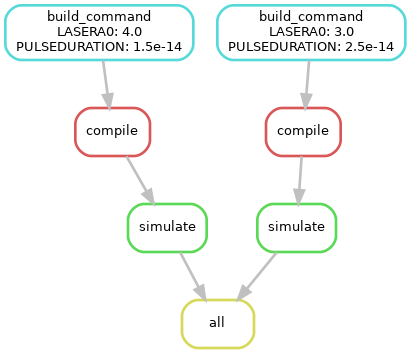

Example usage of snakemake to execute PIConGPU parameter scan.

Snakemake is a python based workflow engine which can be use to automate compiling, running and post processing of PIConGPU simulations, or any other workflow which can be represented as a directed acyclic graph (DAG). 

Each worklfow consists of a Snakefile in which the workflow is defined using rules. Each rule represents a certain task. The dependencies between rules are defined by input and output files. Each rule can consist out of a shell command , python command or external python scripts (apparently also Rust, R, Julia and JupyterNB are supported). 

This example on how to perform a parameter scan in PIConGPU using Snakemake consits of 5 rules.

rule all:
- Is the so called target rule. By default Snakemake only executes the very first rule given in the Snakefile. Therefore this pseudo-rule should contain all the anticipated output data as it's input. Snakemake will then try to generate this input.

rule compile:
- Clones a PIConGPU project using 'pic-create'.
- Since Snakemake relies on files to check dependencies between tasks and a simulation has no predefined unique output file, the idea is to create such a file by appending a 'touch' command to the end of the .tpl file.
- Compiles and then creates simulation directory.
- In the shell script: Please check the 'pic-build' and 'tbg' command since they are unique for every usecase and are not completly generalized yet.  

rule simulate:
- To use the 'tbg' interface the rule simulate is a local rule.
- The output file ('simulated/finished_{paramspace.wildcard_pattern}.txt') is created after the simulation but the shell script would be immediately done after submitting the simulation. If the task is done and the output file is not created an error occures and the workflow fails. In order to make Snakemake wait till the simulation is finished, the status of the slurm job is checked every 30 seconds. 
- The if statements are necessary in case the workflow or the slurm job fails or are canceled during runtime.    

rule post_processing:
- Is a simple example of using an external script to process data.

rule optimize:
- Like 'post_precessing' but uses 'expand()' method.
- The 'expand()' method can be used to express that a file for every instance of 'paramspace.instance_patterns' is needed as input (or output). (Hint: can also be used in the target rule)
- 'expand()' can also be used to combine different variables like wildcards or paramspaces.

General comments:

Starting the workflow:
     - In the directory where your Snakefile is located run 'snakemake --executor slurm --jobs 2 --group-components group1=2 --latency-wait 30 --ignore-incomplete'
     - If the command gets to long because of too many used flags, consider defining the command line arguments in a profile (config.yaml) and run 'snakemake --profile path/to/profile'

Cluster execution
    - To submit certain rules to the cluster you need to install an executer plugin, for slurm the 'snakemake-executor-plugin-slurm'.
    - To use the plugin use the flag '--executor slurm'
    - The needed ressources can be specified in a config.yaml file or directly in the Snakefile, like in the example. It is also possible to define 'default-resources' if several jobs require the same ressources.
    - By default snakemake submitts as many jobs as requested to the cluster. To limit the number of submited jobs use '--jobs 10' for a maximum of 10 jobs in parallel.
    - By default each rule/task is executed in a single job. To execute several tasks in one job define groups in the Snakefile (or command line interface), which only works if the grouped tasks are connected in the DAG.
    - By using '--group-components' one can specify how many tasks in one group shall be executed in one cluster job.
    - If some rules shall not be executed on the cluster, specify them in the beginning of your Snakefile using the keyword 'localrule'.

Params
    - Defined Params can be used in the shell or python scripts.
    - To access params in external python script use 'snakemake.params[i]' or 'snakemake.params.name_of_param'.
    - Accordingly one can use 'snakemake.input' or 'snakemake.output'.

Parameter space exploration
    - To work efficient with parameters one can use wildcards or the parameter space exploration like in this example.
    - In the example the workflow executes the rules compile, simulate and postprocessing for every set of parameters in the input_params file.
    - The naming scheme of the parameter space is definde by the 'Paramspace()' methode and called by '{paramspace.wildcard_pattern}'.
